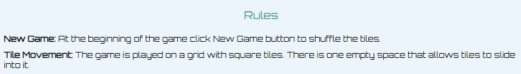
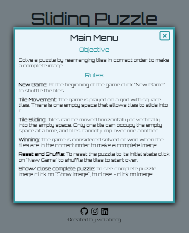

# **Sliding Puzzle**

## **Overview**

A Sliding Puzzle game is a popular classic type of puzzle that involves arranging tiles, also known as squares, in a specific order by sliding them around in a confined space. The most common is 3X3 or 4X4 grid puzzle with one empty space to allow for a movement. The objective is to rearrange the tiles to make a complete image in as little moves as possible. Originally it is known as one puzzle game when one holds the actual puzzle in hands. As a big fan of puzzles myself I set a goal of creating a game anyone can take with them with more than one option of image to choose from.

[Link to the live website](https://violaberg.github.io/sliding-puzzle-game/)

## **Table of Contents**

- [**Sliding Puzzle**](#sliding-puzzle)
  - [**Overview**](#overview)
  - [**Table of Contents**](#table-of-contents)
  - [**Planning**](#planning)
    - [**Intended Users**](#intended-users)
    - [**User Stories**](#user-stories)
    - [**Goals**](#goals)
    - [**Wireframes**](#wireframes)
    - [**Color Scheme**](#color-scheme)
    - [**Fonts**](#fonts)
  - [**Features**](#features)
    - [**Favicon**](#favicon)
    - [**Header**](#header)
    - [**Logo**](#logo)
    - [**Menu**](#menu)
    - [**Footer**](#footer)
    - [**Future development**](#future-development)
  - [**Testing**](#testing)
  - [**Deployment**](#deployment)
  - [**Credits**](#credits)
    - [**Content**](#content)
    - [**Media**](#media)

## **Planning**

### **Intended Users**

- Anyone who loves puzzles.
- Anyone with nostalgia for classic games.
- People who are looking for fun with added challenge.

### **User Stories**

- As a user, I want to know the main intention of the site.
- As a user I want to play puzzle on the go.
- As a user I want to play puzzle without compromising space.
- As a user I want to be able to navigate through the site easily.

### **Goals**

- Make site easy to navigate through.
- Make a responsive game for media screens from 310px wide and up
- Provide a free puzzle game.
- Provide simple and short rules of the game.
- Provide information of moves used to complete the puzzle.

### **Wireframes**

To help planning and designing this project I made desktop and mobile wireframes. While I made some changes as I went along, please find original wireframes attached bellow:

- [Desktop main page](assets/images/desktop-wireframe.png)
- [Desktop menu](assets/images/desktop-menu-wireframe.png)
- [Mobile wireframes](assets/images/mobile-wireframe.png)

### **Color Scheme**

For color scheme I chose cool colors as, especially shades of blue, are often associated with a sense of calm and relaxation. Puzzle games can be mentally challenging, and using calming colors can help players stay focused without feeling overwhelmed. They can promote concentration and mental clarity to improve critical thinking and problem-solving. Cool colors are less likely to cause eye strain therefore prolonging gaming sessions without visual discomfort. For gaming window background I chose dark gray allowing puzzle pieces to stand out with higher contrast. This can make it easier for players to see and interact with the game elements.

### **Fonts**

I chose Orbitron font to suit the game theme of the project.

## **Features**

### **Favicon**

Favicon was created by myself with idea to recreate the look of sliding puzzle. I used [Faviconer](http://www.faviconer.com/) website to create it.

### **Header**

Header was kept minimalistic as it keeps the game's focus on the gameplay itself. Since puzzle games often require players to concentrate and think critically, having a clutter-free header reduces distractions and allows players to immerse themselves in the game's challenges.

### **Logo**

During development I decided against adding an image for logo not to cluster the game look and kept it simple with title in a font suitable for my game

### **Menu**

Menu was kept minimalistic to blend well with style. Accessible through Menu button with Rules and Objective as content. Once open it covers the rest of the game so not to interrupt it.

### **Footer**

A clean footer adapts well to various screen sizes, including mobile devices. It ensures that the footer remains legible and functional on smaller screens, enhancing the user experience. Social media icons provide users with easy access to my social profiles, including Instagram where users can find some of images used for puzzles.

### **Future development**

I really enjoyed creating this game and would love to have more time to develop it further but as everything in life, this project had its deadline and I'm happy with result of this as MVP. In future I would like to enhance the game by following:

- Add image choice for puzzle
- A separate color theme for each puzzle
- A hint option, a timer for additional challenge
- A log in to see history of games
- A scoreboard
- Originally I had planned to have 2 levels for game, such as 3x3 and 4x4 sliding puzzle but as I ran out of time, it has become another feature to add in future.

## **Testing**

I have included details of testing in a separate file [TESTING.md](TESTING.md).

## **Deployment**

The website was deployed to GitHub pages:

1. From this project's [repository](https://github.com/violaberg/sliding-puzzle-game), go to the **Settings**.
2. From the left-hand menu, click on the **Pages**.
3. Under the **Source** section, select the **Main** branch from the drop-down menu and click **Save**.
4. A message will appear to confirm a successful deployment to GitHub pages and provide the live link.

[Link to the live website](https://violaberg.github.io/sliding-puzzle-game/)

## **Credits**

- The biggest thank you as always to my family during this busy time of juggling project, hackathon and life in general.
- Thank you as well to my mentor [David Bowers](https://github.com/dnlbowers) who supported my ambitious idea of making puzzle game in such a short time with no previous experience. And thank you for introducing me to rubber duck idea - it really did listen and solve my coding bugs.
- And thank you to [Kim](https://github.com/kimatron) for support and in general for convincing me to take on this course.

### **Content**

Content was written by myself.

### **Media**

I extensively used various sources to learn about JavaScript to create this project such as:

- [Geeks for geeks](https://www.geeksforgeeks.org/)
- [W3 schools](https://www.w3schools.com/)
- Watched many tutorials on [Youtube](https://www.youtube.com/)
- Explored severel repositories on [GitHub](https://github.com/)
- [CSS tricks](https://css-tricks.com/)
- [Stack overflow](https://stackoverflow.com/questions/45607982/how-to-disable-background-when-modal-window-pops-up)

- Photo used for puzzle was taken by myself.
- Puzzle image was cut in tiles using [Image Online](https://imageonline.co/)
- Empty tile was created by editing image downloaded from [Vecteezy](https://www.vecteezy.com/vector-art/25256483-drying-editable-and-resizeable-vector-icon)
- All icons are from [Font Awesome](https://fontawesome.com/)
- Favicon was generated with [Faviconer](http://www.faviconer.com/)
