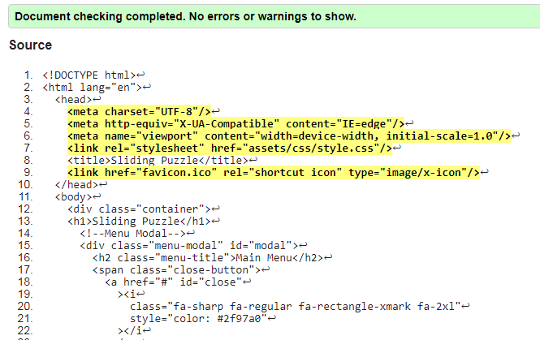
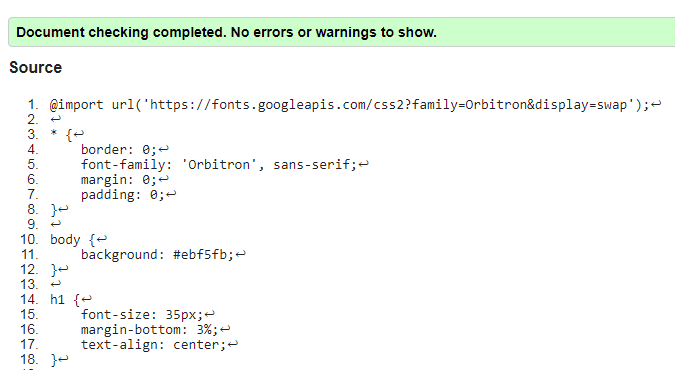
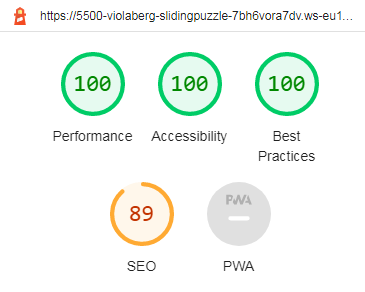
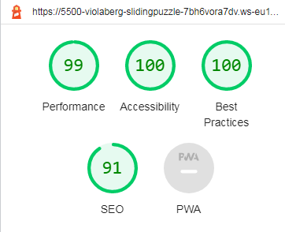

# Testing Page

## **Testing during development**

* Manually tested each element for appearance and responsiveness with Dev Tools.
* Asked friends and family to play the game.
* During testing I checked few browsers to ensure compatibility:
  * ***Mozilla Firefox*** - GOOD
  * ***Microsoft Edge*** - GOOD
  * ***Chrome*** - GOOD
  * ***Safari*** - Tested only on iPhone as it is my only way to access IOS

### **Bugs and fixes**

* **Wanted Outcome** - Clearly shown paragraphs in menu under Objectives and Rules.
  * ***Issue Found and solution used*** - Paragraphs weren't visible at all. Eventually I found two properties set in CSS for them: 'overflow: hidden' and 'max-height: 0', once I removed them, issue was fixed.
  * ***Issue Found and solution used*** - Console error: Can't read properties of null. With some help from Slack, we found I call moveTiles function twice. Second time around it was throwing error, once I removed the line, error was gone.

## **Testing after development**

### **Validator Testing**

* While testing in JShint during development, I noticed few unused valuables that I haven't noticed before and could delete safely. No errors left.

### **Lighthouse**

### **Am I Responsive**

I used [Am I Responsive](https://amiresponsive.co.uk/) website as well. Here is the outcome:

### **DevTools**
