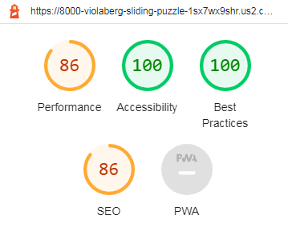
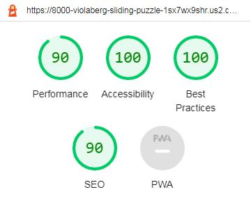
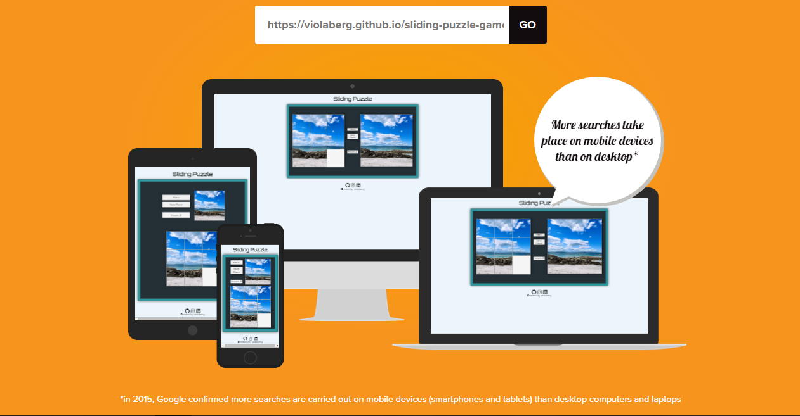
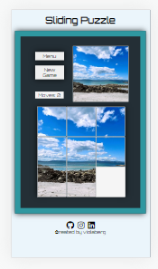
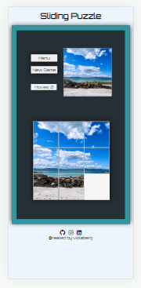
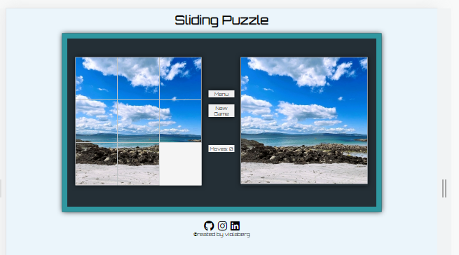

# Testing Page

## **Testing during development**

* Manually tested each element for appearance and responsiveness with Crome DevTools.
* Asked friends and family to play the game.
* During testing I checked few browsers to ensure compatibility:
  * ***Mozilla Firefox*** - GOOD
  * ***Microsoft Edge*** - GOOD
  * ***Chrome*** - GOOD
  * ***Safari*** - No access to IOS, used Chrome DevTools to set responsiveness for IOS screens.

### **Bugs and fixes**

* **Wanted Outcome** - Clearly shown paragraphs in menu under Objectives and Rules.
  * ***Issue Found and solution used*** - Paragraphs weren't visible at all. Eventually I found two properties set in CSS for them: 'overflow: hidden' and 'max-height: 0', once I removed them, issue was fixed.

## **Testing after development**

### **Validator Testing**

* HTML - No errors or warnings where found using [W3C validator](https://validator.w3.org/)
* CSS - No errors where found
* Javascript - while testing code in [JShint](https://jshint.com/) during development, I noticed few unused valuables that I haven't noticed before and could delete them safely. Once removed, no other errors were found.

### **Lighthouse**

Lighthouse results varied slightly depending on a time of day:

* Mobile version:

* Desktop version:

### **Am I Responsive**

I used [Am I Responsive](https://amiresponsive.co.uk/) website to check for responsiveness. Here is the outcome:

### **DevTools**

I extensivelly used Chrome DevTools for responiveness. It helped with changing game layout for more narrow screens such as tablets and mobile phones. I took some screenhots and added bellow:

